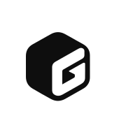

<br/>
<p align="center">
  
</p>

<h1 align="center">Loom UI</h1>

<p align="center">
  The Enterprise Design System and Accessible Component Foundation for <strong>Green Loom</strong>
</p>

<p align="center">
  <span style="display: inline-block; padding: 2px 8px; border-radius: 6px; background-color: rgba(16,185,129,0.1); color: #059669; font-weight: bold; border: 1px solid rgba(16,185,129,0.2);">v1.0.0</span> &nbsp;
  <span style="display: inline-block; padding: 2px 8px; border-radius: 6px; background-color: rgba(16,185,129,0.1); color: #059669; font-weight: bold; border: 1px solid rgba(16,185,129,0.2);">WCAG AAA Compliant</span> &nbsp;
  <span style="display: inline-block; padding: 2px 8px; border-radius: 6px; background-color: rgba(16,185,129,0.1); color: #059669; font-weight: bold; border: 1px solid rgba(16,185,129,0.2);">Zero A11y Violations</span> &nbsp;
  <span style="display: inline-block; padding: 2px 8px; border-radius: 6px; background-color: rgba(16,185,129,0.1); color: #059669; font-weight: bold; border: 1px solid rgba(16,185,129,0.2);">TypeScript Native</span>
</p>

<br/>

## ✨ Key Features

- **Dense Data Ergonomics**: Engineered for high-density tables, multi-tier filters, financial workflows, and enterprise dashboards.
- **Strict Accessibility (WCAG AAA)**: Full keyboard navigation, automated axe-core zero violation score, and high-contrast dark theme surfaces (`#0D1117`).
- **Powder Green Design Tokens**: Harmonic natural palette paired with Geist typography and Hugeicons stroke iconography.
- **AI-Native MCP Server**: Integrated `@greenloom/mcp` Model Context Protocol server for Claude Code, Cursor, and IDE coding agents.
- **Cross-Platform**: Unified component APIs across React Web and React Native.

---

## 🚀 Getting Started for Developers

### 1. Clone & Install

```bash
git clone https://github.com/romeet9/greenloom-ui.git
cd greenloom-ui
yarn install
```

### 2. Start Storybook (Component Explorer)

```bash
yarn react:storybook
```
Open **[http://localhost:9009](http://localhost:9009)** in your browser to view all 80+ components, interactive docs, and theme playgrounds.

### 3. Build Packages

```bash
# Build core Loom UI packages
yarn build

# Build Loom UI MCP server
yarn --cwd packages/blade-mcp build
```

---

## 📦 Monorepo Packages

| Package | Directory | Description |
| :--- | :--- | :--- |
| **`@greenloom/ui`** | [`./packages/blade`](./packages/blade/) | The core Loom UI component library, tokens, and theme providers. |
| **`@greenloom/mcp`** | [`./packages/blade-mcp`](./packages/blade-mcp/) | Model Context Protocol (MCP) server for AI assistants building Loom UI code. |
| **`@greenloom/svelte`** | [`./packages/blade-svelte`](./packages/blade-svelte/) | Svelte adapter for Loom UI components. |

---

## 🤖 Using the Loom UI MCP Server

Connect your AI assistants (Claude Code, Cursor, Windsurf, Antigravity) to generate compliant Loom UI code:

```json
{
  "mcpServers": {
    "loom-ui": {
      "command": "node",
      "args": ["path/to/greenloom-ui/packages/blade-mcp/dist/server.js"]
    }
  }
}
```

---

## 📝 License

Licensed under the [MIT License](./LICENSE.md).
